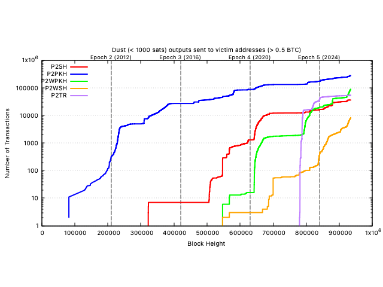

[](https://github.com/bubb1es71/dusts/actions/workflows/rust.yaml)
[](https://choosealicense.com/licenses/mit/)

## Overview

Collects statistics and details for dust size utxos sent to the same addresses that larger utxos have been sent to. The larger utxos are assumed to be owned by a dust attack victim.

This tool borrows heavily from: https://github.com/bitcoin/bitcoin/blob/master/contrib/utxo-tools/utxo_to_sqlite.py


## Usage

```
A tool that parses "bitcoin-cli dumptxoutset latest" output files to gather dust statistics and details

Usage: dusts <IN_FILE> [OUT_FILE]

Arguments:
  <IN_FILE>   Filename of compact-serialized UTXO set file to load [env: DUSTS_INFILE=]
  [OUT_FILE]  Filename for saving dust coin data [env: DUSTS_DATADIR=] [default: dusts.csv]

Options:
  -h, --help     Print help
  -V, --version  Print version
```

The input UTXO set is generated by Bitcoin Core with the `dumptxoutset` RPC:

```bash
$ just dumptxouts
```

Run the tool:

```bash
$ just run data/main_utxo.dat

1048576 coins loaded [  1%] 793s remaining
2097152 coins loaded [  1%] 790s remaining
3145728 coins loaded [  2%] 787s remaining
4194304 coins loaded [  3%] 803s remaining
...
160432128 coins loaded [ 98%] 27s remaining
161480704 coins loaded [ 98%] 20s remaining
162529280 coins loaded [ 99%] 12s remaining
163577856 coins loaded [100%] 4s remaining

Processed 164123684 utxos in 1235.064403667s, 132887 utxos/s.
network: bitcoin
chain tip block hash: 0000000000000000000091c816b6f32e399ac6145cacac359d99410b17111d31
num utxos: 164123684
```
| script type | victim utxos | dust utxos | total | dust % of victims |
| ----------- | ------------ | ---------- | ----- | ----------------- |
| P2PKH | 428505 | 279285 | 707790 | 65.18 |
| P2SH | 362129 | 36483 | 398612 | 10.07 |
| P2WPKH | 836884 | 88560 | 925444 | 10.58 |
| P2WSH | 46697 | 8368 | 55065 | 17.92 |
| P2TR | 19998 | 54427 | 74425 | 272.16 |

Plot dusts.csv data:

```bash
$ just plot
```
